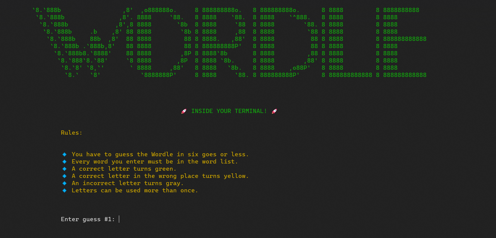

# Wordle: DBMS Project

A terminal based Wordle game for my university DBMS project. It uses **PostgreSQL** RDBMS.




### What is Wordle?

Wordle is a 5-letter word guessing game. An answer-word is created at random, and the player has to guess the answer-word following some rules. The rules are given below:

- Player have to guess the word in six tried or less
- Every word the player enters must be in the word list (List of around 12k words)
- After each guess, the correct letter turns green
- After each guess, a correct letter in the wrong place turns yellow
- After each guess, an incorrect letter turns grey
- Letters can be used more than once


### How to play?

To play this locally:

- Download PostgreSQL for your OS

  > Download link: [https://www.postgresql.org/download/](https://www.postgresql.org/download/)

- Create a user with:

  - Username: **admin**
  - Password: **admin**

- Create a database named `wordle_dbms` and grant all privileges on the database and its tables to the user `admin`

- Create tables:

  - ```sql
    CREATE TABLE answers(id INT PRIMARY KEY, content VARCHAR(6))
    ```

  - ```sql
    CREATE TABLE allowed(id INT PRIMARY KEY, content VARCHAR(6))
    ```

- Navigate to the `utils/DB.py` file of the project structure and uncomment the lines after line number 126 and run:

  ```shell
  $ python DB.py
  ```

- Delete or comment those lines again (as they are not needed now)

- Navigate to the root of the project structure and run the main file:

  ```shell
  $ python main.py
  ```

- And play wordle locally inside your terminal!


### Data files

There are two data files in the `data` directory.

- `answers.txt`: Contains **2309 words**. The possible answers for the game.
- `allowed.txt`: Contains **10663 words**. The words which are allowed to be used as a guess (It can contain words from `answers.txt` too)

These words are taken directly from the official Wordle game's source code.